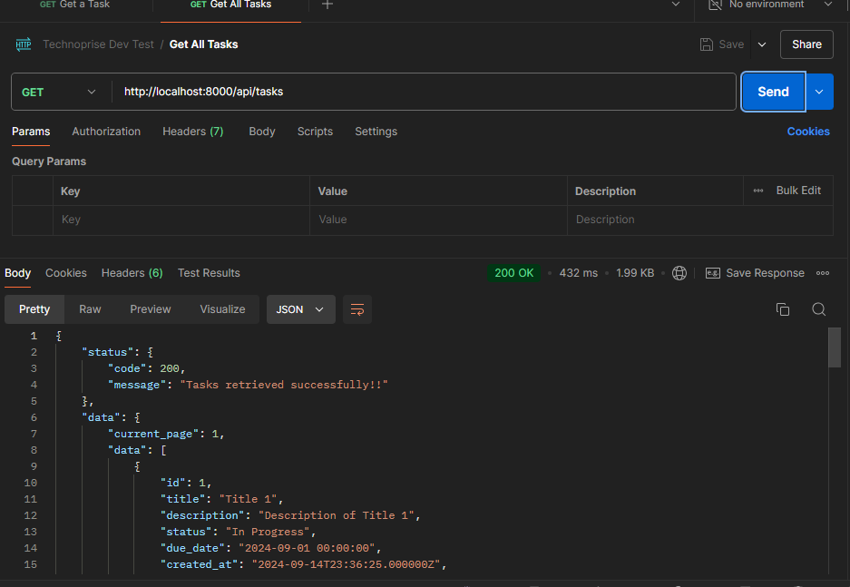
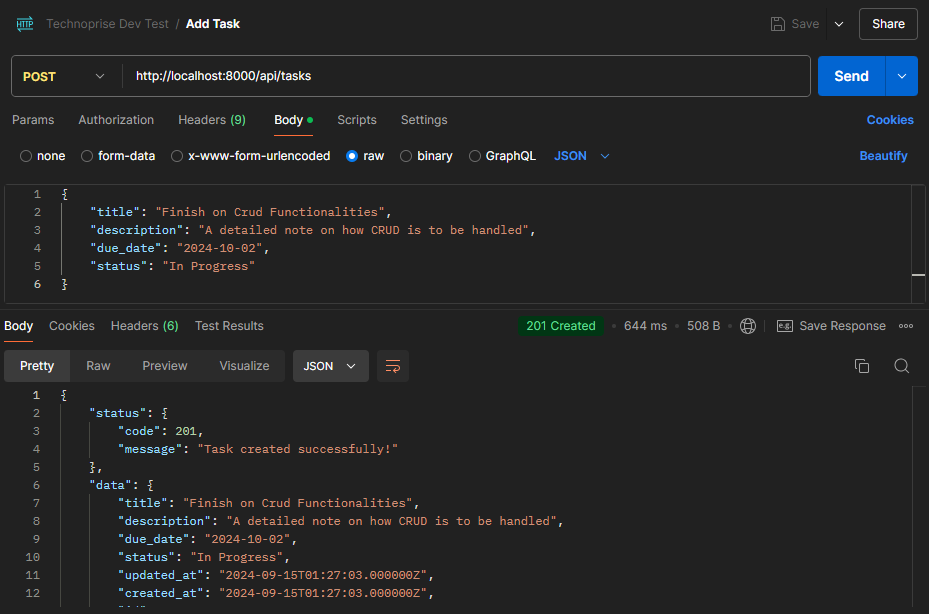
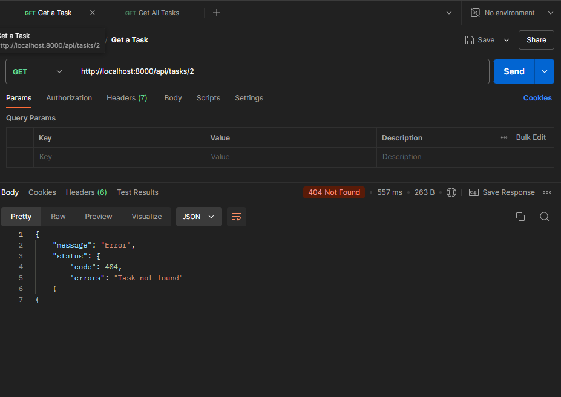
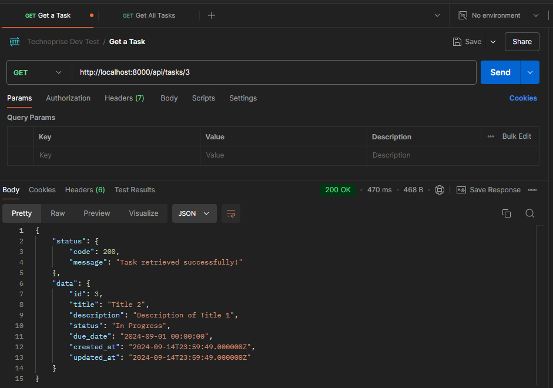
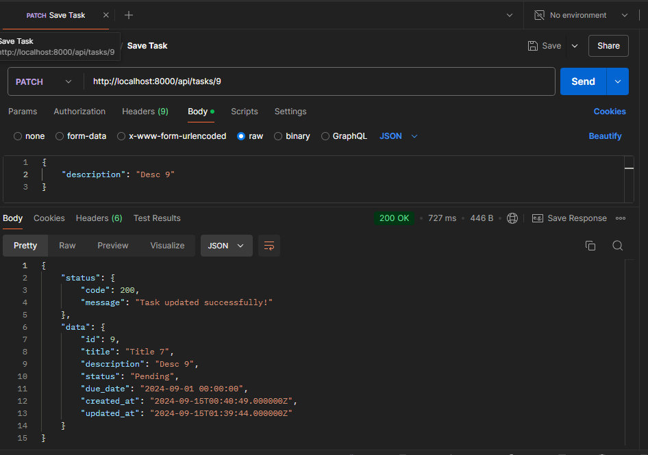
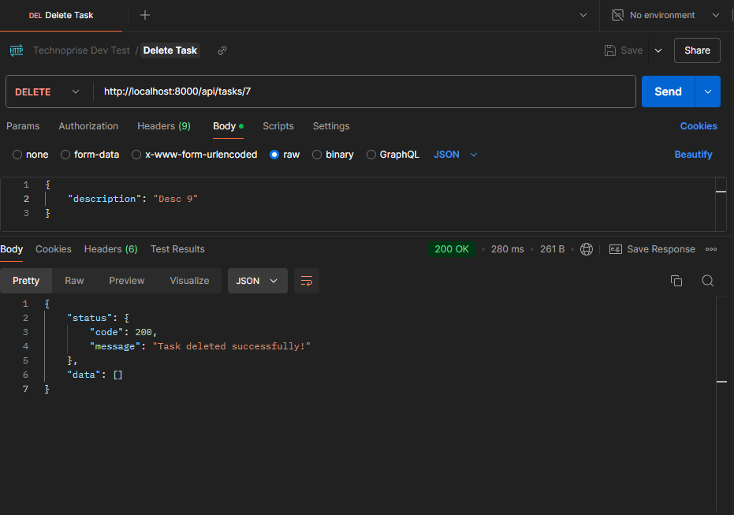
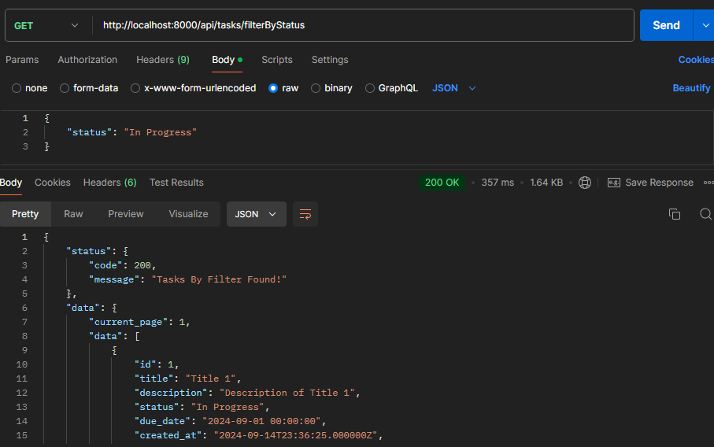
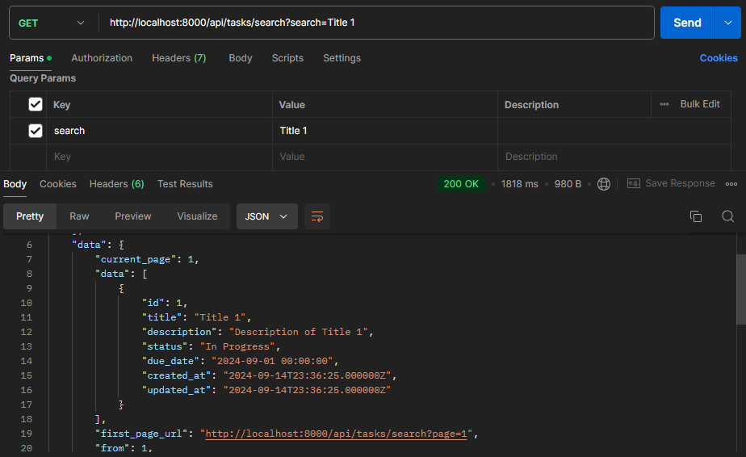

Sure, here's a README file that outlines the steps to set up and run the provided Laravel application:

# Laravel Task Management API

This is a simple Laravel API for managing tasks, including CRUD operations, filtering by status, and searching for tasks.

## Installation

1. Clone the repository:

```bash
git clone https://github.com/KWangechi/task_api_technoprise.git
```


2. Install Composer dependencies:

```bash
composer install
```

4. Copy the `.env.example` file to `.env` and configure your database credentials:

```bash
cp .env.example .env
```

5. Generate an application key:

```bash
php artisan key:generate
```

6. Migrate the database:

```bash
php artisan migrate
```

7. Start the development server:

```bash
php -S localhost:8000 -t public
```

Now you can access the API at http://localhost:8000.

## API Endpoints

- GET `/api/tasks` - Retrieve a paginated list of tasks.



- POST `/api/tasks` - Create a new task.


- GET `/api/tasks/{id}` - Retrieve a single task by ID.
 - If the task doesn't exist
 - if the task exists

- PUT/PATCH `/api/tasks/{id}` - Update an existing task by ID.



- DELETE `/api/tasks/{id}` - Delete a task by ID.



- GET `/api/tasks/filterByStatus    ` - Retrieve tasks filtered by status.



- GET `/api/tasks/search?search={query}` - Search for tasks by title or description.


